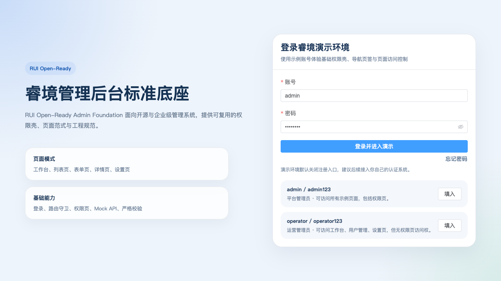
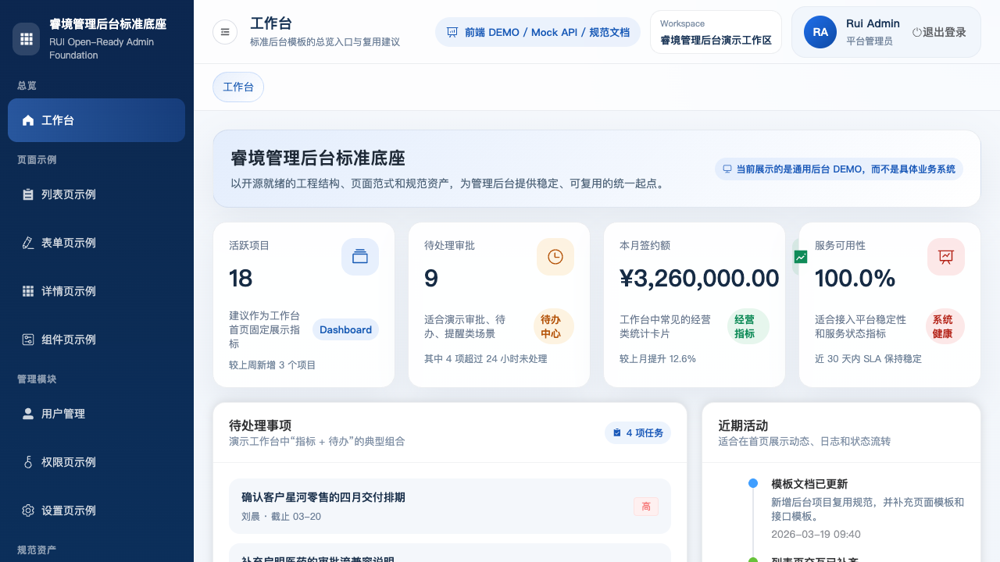
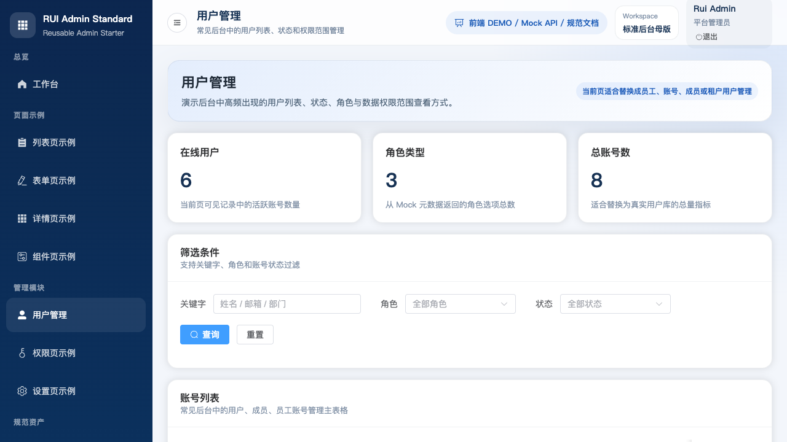
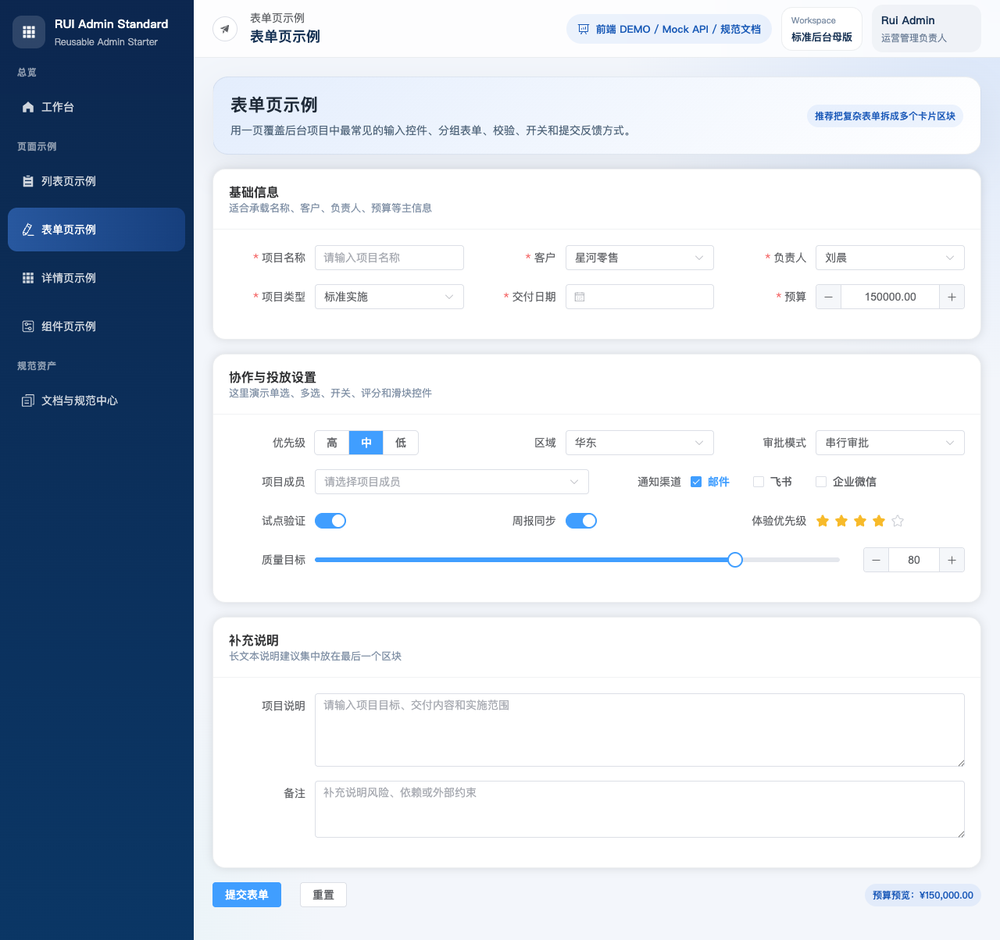
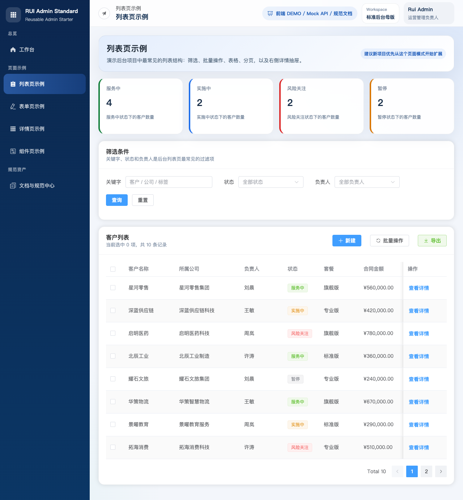
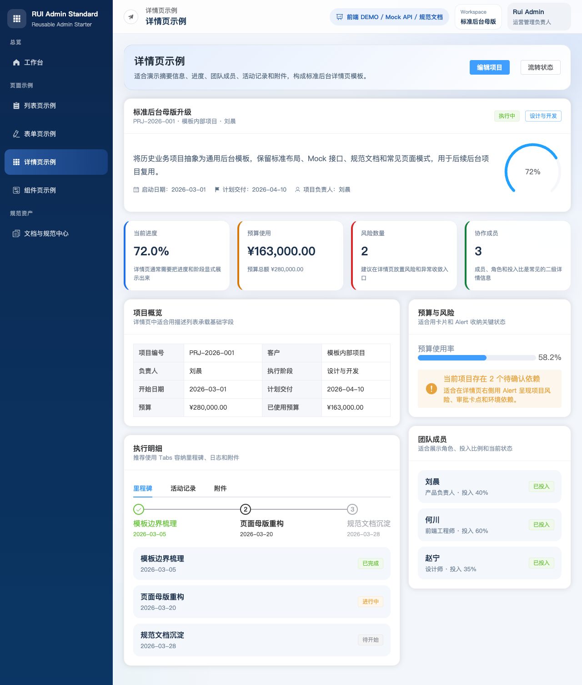

# 睿境管理后台标准底座

`RUI Open-Ready Admin Foundation`

面向“后台管理系统”场景的可复用标准底座仓库。

主干目标不是承载某个具体业务，而是固化一套可以反复起项目的后台标准：

- 技术栈基线：`Vue 3 + Vite + Element Plus + Apache ECharts + Pinia + Vue Router`
- 结构基线：`web + mock-server + docs + site`
- 设计基线：后台布局、卡片、表格、表单、详情、组件展示
- 文档基线：规范说明、技术方案、接口示例、测试验收文档、模板文档、示例包

## 开源授权

本仓库采用 [Apache License 2.0](./LICENSE)。

这意味着在许可证约束内，你可以：

- 个人或企业使用
- 商业使用与私有部署
- 复制、修改、分发与二次开发
- 把本项目作为脚手架、模板仓库、学习样例或派生项目基础

维护者明确欢迎：

- 人类开发者直接使用、修改和再分发本项目
- AI 助手、代码代理、自动化系统在适用法律与许可证范围内读取、分析、修改、生成衍生内容或参与开发流程

本仓库不额外附加“禁止 AI 使用”“禁止 AI 训练”“禁止商用”等限制性条款；如你引入第三方素材、模型、数据或依赖，请自行确认其各自许可证和权利边界。

## 社区与安全

为便于公开协作，仓库同时提供：

- [行为准则](./CODE_OF_CONDUCT.md)
- [安全披露政策](./SECURITY.md)
- [支持说明](./SUPPORT.md)
- [Discussions 使用说明](./DISCUSSIONS.md)
- [贡献说明](./CONTRIBUTING.md)
- [变更记录](./CHANGELOG.md)

同时，仓库已提供 GitHub Issue / PR 模板，便于公开协作时收集复现信息、需求背景和自检结果。

如果你准备公开 Fork、接收 PR 或让 AI/Agent 参与协作，建议一并保留这些文件和模板。

## 适用方式

你可以把这个仓库当成三种东西来使用：

1. 起步模板：直接复制一份，替换菜单、页面和 mock 数据，开始新后台项目。
2. 设计样板：把 `web` 当成通用后台 DEMO，作为布局、控件和页面模式参考。
3. 规范仓库：把 `docs/standards` 作为团队约定入口，约束以后同类项目的技术和交付方式。

## 目录结构

```text
.
├── .codex/skills          # 模板仓库维护用 AI 协作 skills
├── docs
│   ├── api                 # 通用后台 DEMO 接口说明
│   ├── examples            # 业务项目启动示例包
│   ├── qa                  # 业务项目测试与验收文档
│   ├── standards           # 技术、设计、代码、文档规范
│   ├── tech                # 模板工程技术方案
│   ├── templates           # 可直接复制的文档模板
│   └── README.md           # 文档目录总览
├── mock-server             # 通用后台 DEMO Mock API
├── scaffolds               # 业务项目初始化资产与 AI skills 包
├── scripts                 # 一键启动、停止、状态检查脚本
├── site                    # 对外官网 landing page（GitHub Pages）
└── web                     # Vue 后台前端 DEMO
```

## 当前主干包含什么

- 基础权限壳：登录页、路由守卫、403 页面
- 通用工作台 Dashboard
- 列表页示例：筛选、标签、分页、详情抽屉
- 表单页示例：常见控件、校验、分组提交
- 详情页示例：概览、进度、成员、时间线、附件
- 组件页示例：按钮、Tag、Alert、Tabs、Steps、Dialog、Drawer、Empty
- 数据可视化页示例：折线、堆叠柱状、圆环、雷达、Top 排名、仪表盘
- 管理页示例：用户管理、权限页、设置页
- 账号入口示例：右上角紧凑账号下拉、个人中心、修改密码
- 文档页示例：模板说明、规范入口、目录映射
- 独立 Mock 服务：演示前后端分离结构和基础接口组织方式
- 独立官网 landing page：用于 GitHub 仓库展示和对外介绍

## 界面预览

以下截图来自当前主干 DEMO 的真实运行界面，便于快速判断这套模板的可复用程度和页面风格。

| 登录页 | 工作台 Dashboard |
| --- | --- |
|  |  |

| 用户管理页 | 表单页示例 |
| --- | --- |
|  |  |

| 列表页示例 | 详情页示例 |
| --- | --- |
|  |  |

## 官网 Landing Page

仓库已提供一个独立静态官网目录：`site/`。

这个目录的职责不是承载后台业务逻辑，而是作为仓库的对外展示层，用于：

- 说明这套底座适合谁、解决什么问题
- 展示真实界面截图和能力边界
- 为 GitHub、文档、启动说明提供统一入口
- 通过 GitHub Pages 发布一个简单官网

仓库同时提供了 GitHub Actions 工作流：`.github/workflows/deploy-site.yml`。

如果你希望把官网发布到 GitHub Pages，建议在仓库 `Settings -> Pages` 中把发布源切到 `GitHub Actions`。工作流会直接发布 `site/` 目录内容。

## 项目内置 Skills

本仓库内置了 3 个项目级 AI 协作 skill，适合在支持项目内 skills 的 Codex / Agent 环境中显式调用：

- `$project-product-manager`：把后台需求拆成页面方案、接口草案、范围边界和验收标准
- `$project-developer`：按当前仓库规范实现 `web`、`mock-server`、`docs` 的具体改动
- `$project-tester`：为改动补测试点、回归范围、发布前检查项，并映射到实际验证动作

这些 skills 位于 `.codex/skills/`，默认服务于“模板仓库自身维护”。如果你已经复制本仓库并把新仓库作为真实业务项目使用，建议在业务仓库根目录执行：

```bash
bash ./scripts/init-business-project.sh .
```

该脚本会把 `scaffolds/business-project/.codex/skills/` 里的业务项目版 skills 安装到当前仓库，避免 Codex 继续把业务仓库当成模板展示仓库来处理。

脚本默认只允许首次执行一次；如果确实需要重跑，必须显式使用：

```bash
bash ./scripts/init-business-project.sh --force .
```

无论是模板仓库还是业务项目仓库，都推荐配合以下模板一起使用：

- `docs/templates/业务项目README模板.md`
- `docs/templates/业务项目技术方案模板.md`
- `docs/templates/业务项目接口文档模板.md`
- `docs/templates/业务项目测试验收模板.md`
- `docs/templates/需求拆解模板.md`
- `docs/templates/页面方案模板.md`
- `docs/templates/API设计模板.md`
- `docs/templates/测试验证模板.md`
- `docs/templates/AI业务项目启动提示词模板.md`
- `docs/templates/业务项目初始化清单.md`
- `docs/templates/模板残留检查清单.md`

典型用法示例：

- `用 $project-product-manager 把“客户审批页”拆成页面方案、接口草案和验收标准`
- `用 $project-developer 在这个模板里补一个新的列表页，并同步补 mock`
- `用 $project-tester 给这次改动输出一份回归验证清单`

## AI 使用入口

如果你要把本仓库复制成一个真实业务项目，建议先看以下文件，再开始让 AI 改代码：

- `docs/examples/README.md`
- `docs/templates/业务项目README模板.md`
- `docs/templates/业务项目技术方案模板.md`
- `docs/templates/业务项目接口文档模板.md`
- `docs/templates/业务项目测试验收模板.md`
- `docs/standards/07-AI协作与业务化替换规范.md`
- `docs/templates/AI业务项目启动提示词模板.md`
- `docs/templates/业务项目初始化清单.md`
- `docs/templates/模板残留检查清单.md`

推荐顺序：

1. 先用 `业务项目初始化清单` 确认仓库身份和必改范围。
2. 先阅读 `docs/examples/README.md`，了解示例文档包的完成形态。
3. 再用 `业务项目README模板` 写出当前业务仓库的首版 README。
4. 参考 `业务项目技术方案模板` 写出 `docs/tech/` 下的首版技术方案文档。
5. 参考 `业务项目接口文档模板` 写出 `docs/api/` 下的首版接口文档。
6. 参考 `业务项目测试验收模板` 规划并落稿 `docs/qa/` 下的首版测试与验收文档。
7. 然后用 `AI业务项目启动提示词模板` 让 AI 先输出“受影响文件清单”和“文档替换矩阵”。
8. 再进入页面、路由、接口、Mock 和文档实现。
9. 最后用 `模板残留检查清单` 与 `$project-tester` 做收尾检查。

## 启动

### 一键启动

```bash
cd /path/to/RuiWebAdminStandardStarter
npm run dev:start
```

也可以执行：

```bash
bash ./scripts/dev-start.sh
```

如果你希望在 macOS Finder 中双击启动，可使用：

```bash
./start-dev.command
```

默认情况下：

- Mock 服务端口：`3101`
- 前端端口：`5173`

如果端口被占用，脚本会自动寻找可用端口。

### 单独启动 Mock

```bash
cd /path/to/RuiWebAdminStandardStarter/mock-server
npm run dev
```

说明：当前 `mock-server` 无第三方运行时依赖，`npm install` 可省略。

### 单独启动前端

```bash
cd /path/to/RuiWebAdminStandardStarter/web
npm install
npm run dev
```

前端会把 `/api` 代理到 Mock 服务。

## 停止与状态检查

```bash
cd /path/to/RuiWebAdminStandardStarter
npm run dev:status
npm run dev:stop
npm run dev:restart
```

运行日志写入 `runtime/logs/`，PID 和服务元数据写入 `runtime/pids/` 与 `runtime/services/`。

## 严格校验

```bash
cd /path/to/RuiWebAdminStandardStarter
npm run check:strict
```

这会依次执行：

- `web` 的 ESLint 校验
- `web` 的 Prettier 格式检查
- `web` 的生产构建
- `mock-server` 的语法检查
- `mock-server` 的接口 smoke test

## 推荐的复用流程

1. 复制仓库并重命名项目。
2. 如果新仓库是“真实业务项目”，先执行 `bash ./scripts/init-business-project.sh .`，把本地 AI skills 切换成业务项目版本。
3. 先完成 `docs/templates/业务项目初始化清单.md`，明确哪些文件必须业务化替换。
4. 如需参考完整成品，先阅读 `docs/examples/README.md` 与示例文档包。
5. 参考 `docs/templates/业务项目README模板.md`，先写出当前业务仓库的首版 README。
6. 参考 `docs/templates/业务项目技术方案模板.md`，补齐 `docs/tech/` 下的首版技术方案。
7. 参考 `docs/templates/业务项目接口文档模板.md`，补齐 `docs/api/` 下的首版接口文档。
8. 参考 `docs/templates/业务项目测试验收模板.md`，在 `docs/qa/` 下补齐首版测试与验收文档。
9. 再用 `docs/templates/AI业务项目启动提示词模板.md` 产出“受影响文件清单”和“文档替换矩阵”。
10. 保留 `web/src/layout`、`web/src/styles`、`web/src/router` 作为骨架，用真实业务页面替换 `web/src/views/examples` 下的示例页面。
11. 在前期联调阶段保留 `mock-server`，后期再替换成真实后端。
12. 收尾时执行模板残留检查，确认 `README`、`docs/tech`、`docs/api`、页面文案和示例数据都已与当前业务一致。

## 提交规范

仓库已经内置提交模板和提交约定说明：

```bash
cd /path/to/RuiWebAdminStandardStarter
npm run git:use-template
```

详细说明见：

- `CONTRIBUTING.md`
- `CODE_OF_CONDUCT.md`
- `SECURITY.md`
- `SUPPORT.md`
- `DISCUSSIONS.md`
- `CHANGELOG.md`
- `docs/standards/06-提交与分支规范.md`

默认情况下，向本仓库提交的贡献会按 `Apache-2.0` 许可证授权；使用 AI 辅助生成内容也是允许的，但贡献者需要自行保证代码质量、来源合规性与可维护性。
